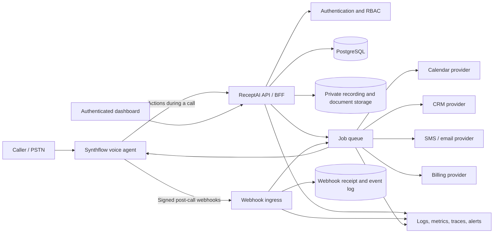
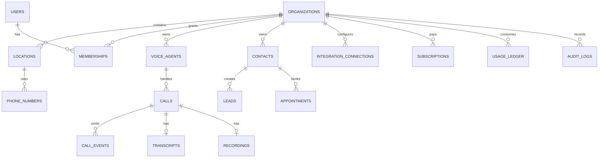
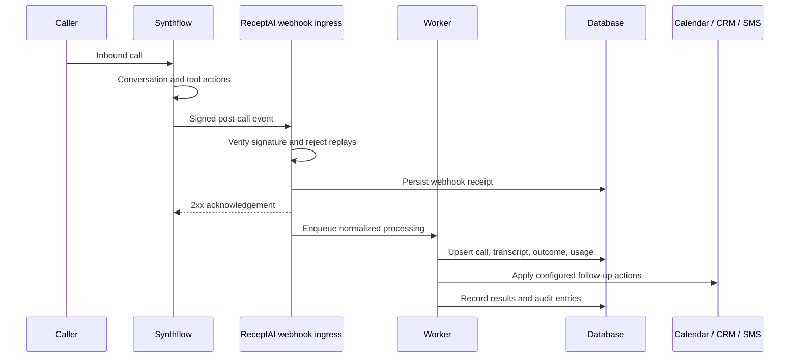

# ReceptAI Architecture

Status: proposed production architecture
Last updated: 2026-07-23

## Purpose

ReceptAI is a white-label SaaS product for local service businesses that use an AI voice receptionist to answer calls, qualify leads, book appointments, and trigger follow-up work.

This document separates the current demo from the production architecture and defines the system boundaries, data ownership, security model, and main application flows. Provider-specific setup and API contracts are documented in [API_INTEGRATIONS.md](./API_INTEGRATIONS.md).

## Current implementation

The current repository is a two-entry Vite frontend:

- `index.html` is the marketing and signup experience.
- `dashboard.html` is the client dashboard.
- `app.js` stores signup information in browser `localStorage`.
- `dashboard.js` renders seeded calls, transcripts, leads, appointments, and analytics.
- `scripts/prepare-sites.mjs` packages the static build for hosting and serves only static `GET` and `HEAD` requests.

There is currently no application backend, database, authentication service, webhook receiver, telephony integration, CRM connection, payment integration, MCP runtime, or connected LLM. The existing dashboard should therefore be treated as a product and sales prototype, not as a production control plane.

## Target architecture

Synthflow owns the latency-sensitive voice media plane. ReceptAI owns the multi-tenant SaaS control plane, business data, customer experience, billing state, integrations, and audit trail.

## Architectural decisions

### 1. Voice AI remains provider-managed for the MVP

Synthflow should handle telephony, speech-to-text, conversational inference, text-to-speech, call routing, and standard post-call processing. ReceptAI should not build a second real-time voice stack until a demonstrated product requirement justifies it.

### 2. The browser communicates only with ReceptAI

The Vite client must never contain Synthflow, Stripe, CRM, calendar, telephony, or LLM credentials. It calls an authenticated ReceptAI API, which applies tenant authorization and then invokes provider APIs.

### 3. Webhooks are the system-of-record ingestion path

Calls and provider events arrive through a signed webhook ingress. Each event is recorded before asynchronous processing so retries are safe and the source payload remains auditable.

### 4. ReceptAI owns normalized business records

The application database is the read model for the dashboard. Provider payloads are normalized into calls, contacts, leads, appointments, usage records, and integration events. The dashboard does not query provider APIs directly.

### 5. Integrations use adapters

Calendar, CRM, billing, messaging, and voice providers sit behind internal interfaces. Provider IDs and raw payloads are retained for reconciliation, but they do not leak throughout the product domain.

### 6. One billing authority

The MVP must select either Synthflow-managed Stripe rebilling or a ReceptAI-managed Stripe implementation. Running two independent subscription and usage ledgers would create entitlement and invoicing conflicts.

## Logical components

| Component | Responsibilities |
|---|---|
| Web application | Marketing pages, onboarding, authenticated dashboard, accessible customer workflows |
| API / BFF | Sessions, validation, tenant authorization, dashboard queries, provider orchestration |
| Authentication service | Sign-in, session lifecycle, invitations, password recovery, optional social login |
| PostgreSQL | Tenants, users, calls, leads, appointments, subscriptions, provider mappings, audit data |
| Webhook ingress | Raw-body verification, replay protection, deduplication, event persistence, rapid acknowledgement |
| Background workers | Provider synchronization, retries, notifications, usage aggregation, scheduled automations |
| Object storage | Private call recordings, knowledge documents, brand assets, exports |
| Integration adapters | Synthflow, calendar, CRM, Stripe, SMS, email |
| Observability stack | Structured logs, metrics, traces, error reporting, alerting |

The web application can remain on the current static host. The API, workers, database, and private storage require server-side infrastructure. Prefer same-origin `/api` routing; if an API subdomain is used, restrict CORS to known ReceptAI origins.

## Multi-tenant data model

Every business-owned record must include an immutable `organization_id`. Locations can provide a second scope within an organization.

Recommended core tables:

- `organizations`, `locations`
- `users`, `memberships`, `roles`
- `voice_agents`, `phone_numbers`, `knowledge_documents`
- `calls`, `call_events`, `transcripts`, `recordings`
- `contacts`, `leads`, `appointments`
- `integration_connections`, `provider_mappings`
- `automations`, `automation_runs`
- `subscriptions`, `entitlements`, `usage_ledger`
- `webhook_receipts`, `outbox_events`, `audit_logs`

Tenant isolation must be enforced in both the API authorization layer and the database. Client-supplied organization identifiers are never sufficient authorization.

## Primary flows

### Customer provisioning

1. The user creates an account and verifies their identity.
2. ReceptAI creates the organization, first membership, and selected plan state.
3. A background job creates or associates the Synthflow subaccount.
4. ReceptAI provisions an agent from an approved template.
5. The customer configures business details, greeting, voice, escalation rules, and availability.
6. A phone number is provisioned or imported.
7. ReceptAI marks onboarding complete only after provider resources are confirmed.

Provisioning operations must be resumable. Store a state machine such as `pending`, `provisioning`, `action_required`, `ready`, and `failed` rather than treating the workflow as one synchronous request.

### Inbound call and post-call processing

The webhook endpoint should acknowledge quickly. Network calls to downstream providers belong in workers, not in the acknowledgement path.

### Appointment booking

1. The voice agent asks ReceptAI for available times or invokes an approved booking action.
2. ReceptAI maps the agent to the tenant's calendar connection.
3. The backend checks current availability and applies working-hour, duration, buffer, and service-area rules.
4. The selected slot is created using an idempotency key.
5. ReceptAI stores the appointment and external event ID.
6. Confirmation and reminder jobs are scheduled.
7. Calendar webhooks reconcile later updates or cancellations.

### Agent configuration

1. A permitted user edits a draft configuration.
2. ReceptAI validates plan entitlements and required fields.
3. The backend updates Synthflow through its adapter.
4. ReceptAI stores the desired and confirmed provider versions.
5. An audit log records actor, timestamp, before state, and after state.

### Billing and usage

1. Subscription webhooks update local subscription and entitlement state.
2. Call events write immutable usage ledger entries.
3. A reconciliation job compares ReceptAI usage with provider usage.
4. Entitlements control agents, numbers, locations, concurrency, included minutes, and overage behavior.
5. Failed payments enter a grace-period state before service restrictions are applied.

## Security boundaries

### Authentication and authorization

- Use secure, HTTP-only, same-site session cookies.
- Require authorization on every tenant-owned resource.
- Support at least owner, administrator, manager, and read-only roles.
- Require recent authentication for billing, credential, and destructive changes.
- Record security-sensitive actions in an immutable audit log.

### Provider credentials

- Store API keys and OAuth refresh tokens only in a managed secret store or encrypted database fields.
- Encrypt tenant OAuth tokens with a dedicated key that is not stored in the database.
- Restrict provider scopes to the minimum required.
- Support connection revocation and credential rotation.

### Webhooks

- Verify each provider's signature against exactly the input its current documentation specifies. Synthflow currently signs `call_id`; providers such as Stripe sign the raw request body.
- Enforce provider timestamp tolerance when supported and add ReceptAI-owned replay protection in all cases.
- Persist a provider event ID or deterministic payload digest under a unique constraint.
- Return `2xx` only after durable receipt.
- Quarantine invalid or unprocessable events without exposing details to the sender.

### Recordings, transcripts, and PII

- Keep recordings and knowledge documents in private storage.
- Issue short-lived signed URLs after an authorization check.
- Define configurable retention and deletion policies.
- Redact secrets and unnecessary personal data from logs.
- Render transcript and CRM content as untrusted input to prevent stored XSS.
- Add call-recording disclosure and messaging consent controls appropriate to each operating region.

## Reliability and event processing

- Use at-least-once delivery and idempotent consumers.
- Apply exponential backoff with jitter to retryable failures.
- Move exhausted jobs to a dead-letter queue with an operator replay action.
- Use an outbox pattern when a database update must publish an event reliably.
- Set provider-specific timeouts, concurrency limits, and circuit breakers.
- Reconcile critical resources such as agents, subscriptions, calendar events, and usage on a schedule.

## Observability

Every request and job should include:

- `request_id`
- `organization_id`
- `provider`
- `provider_resource_id` when present
- `webhook_event_id` or `job_id`
- result category and latency

Initial service-level indicators:

- Webhook acceptance and signature-failure rates
- Webhook-to-dashboard processing latency
- Agent provisioning success rate
- Call completion and transfer outcomes
- Appointment booking success/conflict rate
- CRM and calendar synchronization delay
- Queue age, retry volume, and dead-letter count
- Usage reconciliation variance

Never include full transcripts, recordings, API keys, OAuth tokens, or direct contact details in application logs.

## Deployment topology

Recommended environments:

- `development`: local UI and isolated provider test resources
- `staging`: production-like auth, webhooks, database, and provider sandbox/test accounts
- `production`: separate secrets, database, storage, domains, and provider applications

Database migrations must be forward-compatible with rolling deployments. Webhook endpoints should remain compatible with the previous application version during deployment.

## Open product decisions

Before backend implementation begins, confirm:

1. Synthflow Agency/white-label plan and API entitlements
2. Customer data region
3. Phone-number ownership: Synthflow, Twilio, or SIP
4. First calendar provider: Google, Microsoft, Cal.com, or GoHighLevel
5. First CRM provider: HubSpot or GoHighLevel
6. Billing authority: Synthflow rebilling or ReceptAI-managed Stripe
7. Recording defaults and retention policy
8. Whether the initial product supports one or multiple locations per organization

## Delivery phases

### Phase 1: revenue-path MVP

- Authentication, organizations, memberships, and tenant isolation
- Synthflow subaccount, agent, and number provisioning
- Signed webhook ingestion
- Real calls, transcripts, recordings, and call outcomes
- Calendar booking
- Subscription state and usage entitlements

### Phase 2: operational integrations

- CRM synchronization
- SMS and email automations
- Lead pipeline and appointment management
- Agent settings, test calls, and knowledge-base management
- Analytics, notifications, audit views, and support operations

### Phase 3: platform expansion

- Additional CRM and calendar adapters
- Multi-location management
- Advanced white-label controls
- Optional direct LLM enrichment
- Internal operator copilot with governed MCP tools
